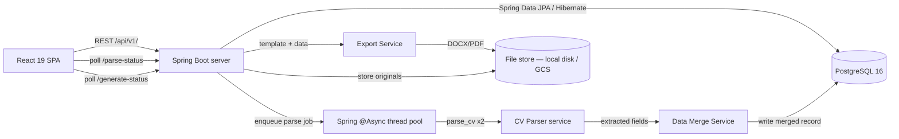

# RecruitSync — Engineering Design Doc

**Author:** TBD
**Status:** Draft v0.1
**Last updated:** 2026-06-25
**Reviewers:** TBD

---

## 1. Summary

RecruitSync is a web-based internal recruitment CRM for agencies placing international candidates into Japanese companies. It is a standard three-tier web app: a React 19 SPA, a Spring Boot REST backend (Java 21), and a PostgreSQL 16 database. The system manages 9 core CRM entities (Users, Clients, Jobs, Candidates, CandidateJobs, PipelineLogs, ActivityLogs, Reminders, FileAssets) plus a 4-table CV pipeline subsystem (CVUploads, CVParsedData, CVTemplates, GeneratedProfiles). The most interesting engineering choices are the dual-file CV parser with data merge engine (async, fire-and-forget with polling) and the formatted CV export pipeline (DOCX template rendering via docx4j → optional PDF conversion via LibreOffice headless). Everything else is deliberately boring. Designed for a single team of < 20 recruiters, deployed on managed GCP services (Cloud Run + Cloud SQL + Cloud Storage) with the frontend on Firebase Hosting.

---

## 2. Assumptions

- **Target scale:** < 20 concurrent users; < 10,000 total records in v1
- **Latency budget:** API responses p95 < 500ms; CV parsing p95 < 30s
- **Platform:** Web-first; responsive for tablet; no native mobile
- **Currency:** JPY is the primary salary currency; stored as integer (no decimal)
- **Languages:** UI in English; CV parser handles English, Japanese, Myanmar input
- **Out of scope:** Real-time collaboration, email integration, offline mode, multi-region, multi-tenancy

---

## 3. Goals & non-goals

**Goals (v1):**
- Full CRUD for all 9 entities with referential integrity
- CV upload (1 or 2 files) → async parse → dual-file merge → field extraction with human-review step before save
- CV template selection → formatted DOCX/PDF generation via template rendering engine
- Generated CV stored as FileAsset; download via signed URL or direct stream
- Pipeline stage tracking per CandidateJob with full stage change history (PipelineLog)
- Activity logs (manual) attached to any entity (Client / Job / Candidate / CandidateJob)
- Reminders with priority, assigned user, due date; team-visible sorted list
- File upload and storage attached to Client, Job, or Candidate
- JWT-based user authentication
- Dashboard aggregation: active job count, candidates by stage, today's reminders, recent placements
- API p95 < 500ms for all list/detail endpoints

**Non-goals (v1):**
- No real-time push (websockets) — polling for parse status is sufficient
- No email send/receive integration
- No AI scoring, ranking, or match recommendations
- No multi-tenancy — single agency per instance
- Designed for < 20 users; horizontal scaling not addressed in v1
- No file CDN — files stored on local disk in dev / Google Cloud Storage in production; no streaming preview

---

## 4. Architecture



**What's here:**
- **React 19 SPA** — all 19 screens; built with Vite + TypeScript + Tailwind CSS; communicates with backend via REST only (Axios + TanStack Query)
- **Spring Boot server** (Java 21) — all business logic, auth, file handling, async parse queue, export orchestration; Spring Web for REST controllers, Spring Security for JWT auth, Bean Validation for request validation, MapStruct for DTO↔entity mapping, Lombok to cut boilerplate, Springdoc OpenAPI for auto-generated Swagger docs
- **PostgreSQL 16** — single relational store for all 9 CRM entities + 4 CV pipeline tables; accessed via Spring Data JPA / Hibernate
- **Spring `@Async` thread pool** — CV parse jobs; `ThreadPoolTaskExecutor`; no external queue service in v1
- **CV Parser service** — isolated Spring service; Apache PDFBox for PDF text extraction, Apache POI for Word, Tess4J (Tesseract JNI binding) for scanned-image OCR; regex heuristics for field extraction; called once per uploaded file
- **Data Merge Service** — combines `ParsedCV` records from File 1 and File 2; merge strategy: File 1 wins for personal data (name, email, phone); File 2 wins for work history and skills; conflicts surfaced for recruiter review
- **Template Mapping Service** — maps candidate fields to template placeholders; templates stored as DOCX with `{{field_name}}` bookmarks
- **Export Service** — renders DOCX via docx4j content-control/placeholder substitution; optional PDF conversion via `LibreOffice --headless`; stores output as FileAsset
- **File store** — local disk in dev (`/data/uploads/{owner_type}/{owner_id}/{folder_path}/`); Google Cloud Storage in production; abstracted behind a `FileStore` interface so the swap is a Spring `@Profile`-scoped bean, not a code change; ZIP generation streams via `java.util.zip.ZipOutputStream` directly to the HTTP response
- **File Workspace Service** — creates default folder trees on entity creation (called inside the POST /clients, /candidates, /jobs controller methods); handles file move (updates `folder_id`, writes two `folder_activity` rows); upserts `folder_notes` on every auto-save; all mutations write an activity entry before touching the primary record

**What's deliberately NOT here:**
- No Redis / RabbitMQ / Kafka — an in-process `@Async` thread pool is sufficient at < 20 users
- No WebSocket server — 3-second polling for parse status is invisible to the user
- No separate auth service — JWT issued and validated by Spring Security; no OAuth in v1
- No Elasticsearch — PostgreSQL `ILIKE` is fast enough at < 10k records
- No separate microservices — one deployable Spring Boot JAR for the entire backend, running on Cloud Run

---

## 5. Key components

### React SPA

- **Responsibility:** Render all 22 screens; manage local UI state; poll parse-status endpoint
- **Tech choice:** React 19 + Vite + TypeScript + Tailwind CSS + TanStack Query + Axios + React Router + `@dnd-kit/core` + TanStack Table + React Hook Form + Zod
- **Why this choice:** TypeScript catches contract drift against the Spring Boot DTOs at compile time; TanStack Query handles caching and polling natively; `@dnd-kit` is accessible and keyboard-capable (required by accessibility spec); React Hook Form + Zod gives schema-driven validation that mirrors the Bean Validation rules on the backend; TanStack Table backs every list/table screen (Clients, Jobs, Candidates, Recruiter Pipeline) without hand-rolled sort/filter logic
- **Interface:** Consumes `GET/POST/PATCH /api/v1/*`; polls `GET /api/v1/candidates/{id}/parse-status` every 3s via `refetchInterval`

### Spring Boot server

- **Responsibility:** REST API, JWT auth, file upload handling, async parse job management
- **Tech choice:** Java 21, Spring Boot 3.x, Maven, Spring Web, Spring Security, Spring Data JPA + Hibernate, Lombok, MapStruct, Bean Validation, Springdoc OpenAPI
- **Why this choice:** Spring Boot is a mature, well-understood stack for a CRUD-heavy CRM with strict relational integrity needs; Spring Security gives JWT auth out of the box; Springdoc auto-generates OpenAPI/Swagger docs for frontend handoff; MapStruct keeps entity↔DTO mapping out of hand-written boilerplate; Lombok removes getter/setter/constructor noise
- **Interface:** `Authorization: Bearer <jwt>` on all routes except `POST /auth/login`

### CV Parser service

- **Responsibility:** Accept a file path + language hint, extract structured fields, return `ParsedCV` or `ParseError`
- **Tech choice:** Apache PDFBox (PDF text extraction) + Apache POI (Word, `.docx`) + Tess4J (Tesseract OCR via JNI, for scanned-image CVs) + regex heuristics for field parsing; language hint used to tune name/phone patterns
- **Why this choice:** Zero per-parse API cost, runs offline, deterministic latency; human review step in the UI absorbs extraction errors; Tess4J covers the scanned-image case that pure text extraction can't
- **Interface:** `ParsedCV parseCv(Path filePath, String language)` — returns a `ParsedCV` DTO or throws a `ParseException` caught at the controller boundary and surfaced as `parse_status: failed`

### PostgreSQL + Spring Data JPA

- **Responsibility:** Durable storage; enforces FK constraints, uniqueness, and cascade rules
- **Tech choice:** PostgreSQL 16 (Cloud SQL in production), Spring Data JPA + Hibernate, Flyway migrations
- **Why this choice:** Relational integrity matters for this schema (9 entities with cross-references); JSONB available via Hibernate's native JSON support if flexible fields are needed later
- **Interface:** JPA repositories and entities; native/JPQL queries used only for complex aggregation (dashboard) and full-text search (`ILIKE`)

### File store

- **Responsibility:** Accept file bytes, persist, return a retrievable path/URL
- **Tech choice:** Local disk (`/data/uploads/`) in dev; Google Cloud Storage in production; abstracted behind a `FileStore` interface, swapped via Spring `@Profile`
- **Why this choice:** Zero cost, zero ops in dev; GCS in production gives durable, regionally-replicated storage that pairs naturally with Cloud Run (no attached disk to manage); the interface abstraction means the swap between profiles is config, not code
- **Interface:** `String save(byte[] fileBytes, String filename, String subfolder)`; `String getUrl(String path)`

---

## 6. Data model

```sql
CREATE TABLE users (
  user_id     BIGSERIAL PRIMARY KEY,
  full_name   VARCHAR(120) NOT NULL,
  email       VARCHAR(255) NOT NULL UNIQUE,
  password_hash TEXT NOT NULL,
  role        VARCHAR(30) NOT NULL DEFAULT 'recruiter',
  created_at  TIMESTAMP NOT NULL DEFAULT CURRENT_TIMESTAMP
);

CREATE TABLE clients (
  client_id     BIGSERIAL PRIMARY KEY,
  company_name  VARCHAR(200) NOT NULL UNIQUE,
  industry      VARCHAR(100),
  contact_person VARCHAR(120) NOT NULL,
  email         VARCHAR(255) NOT NULL,
  phone         VARCHAR(50),
  address       TEXT,
  website       VARCHAR(255),
  notes         TEXT,
  created_by    BIGINT REFERENCES users(user_id),
  created_at    TIMESTAMP NOT NULL DEFAULT CURRENT_TIMESTAMP,
  updated_at    TIMESTAMP NOT NULL DEFAULT CURRENT_TIMESTAMP
);

CREATE TABLE jobs (
  job_id            BIGSERIAL PRIMARY KEY,
  client_id         BIGINT NOT NULL REFERENCES clients(client_id) ON DELETE CASCADE,
  job_title         VARCHAR(200) NOT NULL,
  employment_type   VARCHAR(50) NOT NULL,
  location          VARCHAR(150),
  salary_min        INTEGER,
  salary_max        INTEGER,
  currency          VARCHAR(10) DEFAULT 'JPY',
  required_skills   TEXT NOT NULL,
  experience_years  NUMERIC(4,1),
  japanese_level    VARCHAR(10),
  english_level     VARCHAR(10),
  status            VARCHAR(30) NOT NULL DEFAULT 'active',
  closing_date      DATE,
  notes             TEXT,
  created_by        BIGINT REFERENCES users(user_id),
  created_at        TIMESTAMP NOT NULL DEFAULT CURRENT_TIMESTAMP
);

CREATE TABLE candidates (
  candidate_id          BIGSERIAL PRIMARY KEY,
  full_name             VARCHAR(120) NOT NULL,
  email                 VARCHAR(255),
  phone                 VARCHAR(50),
  total_experience_years NUMERIC(4,1),
  skills                TEXT,
  education             TEXT,
  current_location      VARCHAR(150),
  source                VARCHAR(80),
  parse_status          VARCHAR(20) NOT NULL DEFAULT 'pending',
  original_cv_file_id   BIGINT,
  created_at            TIMESTAMP NOT NULL DEFAULT CURRENT_TIMESTAMP
);

CREATE TABLE candidate_jobs (
  candidate_job_id    BIGSERIAL PRIMARY KEY,
  candidate_id        BIGINT NOT NULL REFERENCES candidates(candidate_id) ON DELETE CASCADE,
  job_id              BIGINT NOT NULL REFERENCES jobs(job_id) ON DELETE CASCADE,
  applied_date        DATE NOT NULL DEFAULT CURRENT_DATE,
  current_stage       VARCHAR(30) NOT NULL DEFAULT 'sourced',
  current_status      VARCHAR(30) NOT NULL DEFAULT 'active',
  assigned_recruiter_id BIGINT REFERENCES users(user_id),
  UNIQUE(candidate_id, job_id)
);
-- current_stage values: sourced | screening | interview | offered | placed | rejected

CREATE TABLE pipeline_logs (
  pipeline_log_id   BIGSERIAL PRIMARY KEY,
  candidate_job_id  BIGINT NOT NULL REFERENCES candidate_jobs(candidate_job_id) ON DELETE CASCADE,
  stage             VARCHAR(30) NOT NULL,
  stage_date        TIMESTAMP NOT NULL DEFAULT CURRENT_TIMESTAMP,
  interview_date    TIMESTAMP,
  result            VARCHAR(30),
  rejection_reason  TEXT,
  updated_by        BIGINT REFERENCES users(user_id)
);

CREATE TABLE activity_logs (
  activity_log_id   BIGSERIAL PRIMARY KEY,
  target_type       VARCHAR(30) NOT NULL,  -- client | job | candidate | candidate_job
  target_id         BIGINT NOT NULL,
  communication_type VARCHAR(30) NOT NULL, -- call | email | meeting | chat
  summary           TEXT NOT NULL,
  next_action       TEXT,
  author_id         BIGINT REFERENCES users(user_id),
  created_at        TIMESTAMP NOT NULL DEFAULT CURRENT_TIMESTAMP
);

CREATE TABLE reminders (
  reminder_id       BIGSERIAL PRIMARY KEY,
  target_type       VARCHAR(30) NOT NULL,
  target_id         BIGINT NOT NULL,
  reminder_date     DATE NOT NULL,
  reminder_type     VARCHAR(50),
  priority          VARCHAR(20) NOT NULL DEFAULT 'medium',
  status            VARCHAR(20) NOT NULL DEFAULT 'open',
  assigned_user_id  BIGINT REFERENCES users(user_id),
  note              TEXT,
  created_at        TIMESTAMP NOT NULL DEFAULT CURRENT_TIMESTAMP
);

-- ── File Workspace tables ─────────────────────────────────────────
-- Replaces the flat file_assets table with a hierarchical folder/file model.

CREATE TABLE folders (
  folder_id        BIGSERIAL PRIMARY KEY,
  parent_folder_id BIGINT REFERENCES folders(folder_id) ON DELETE CASCADE,
                   -- NULL means this is the entity root folder
  owner_type       VARCHAR(30) NOT NULL,  -- client | candidate | job
  owner_id         BIGINT NOT NULL,       -- FK to clients/candidates/jobs (app-enforced)
  folder_name      VARCHAR(200) NOT NULL,
  is_default       BOOLEAN NOT NULL DEFAULT FALSE,
                   -- TRUE = system-created on entity record creation; cannot be deleted
  created_by       BIGINT REFERENCES users(user_id),
  created_at       TIMESTAMP NOT NULL DEFAULT CURRENT_TIMESTAMP,
  updated_at       TIMESTAMP NOT NULL DEFAULT CURRENT_TIMESTAMP,
  UNIQUE (parent_folder_id, folder_name, owner_type, owner_id)
  -- prevents duplicate names within the same parent
);

CREATE TABLE files (
  file_id       BIGSERIAL PRIMARY KEY,
  folder_id     BIGINT NOT NULL REFERENCES folders(folder_id) ON DELETE CASCADE,
  file_name     VARCHAR(255) NOT NULL,
  file_path     TEXT NOT NULL,            -- path in file store (local disk path or GCS object key)
  file_size     INTEGER,                  -- bytes
  mime_type     VARCHAR(100),
  description   TEXT,
  uploaded_by   BIGINT REFERENCES users(user_id),
  uploaded_at   TIMESTAMP NOT NULL DEFAULT CURRENT_TIMESTAMP
);

CREATE TABLE folder_notes (
  note_id       BIGSERIAL PRIMARY KEY,
  folder_id     BIGINT NOT NULL REFERENCES folders(folder_id) ON DELETE CASCADE,
  content       TEXT NOT NULL DEFAULT '',
  last_edited_by BIGINT REFERENCES users(user_id),
  last_edited_at TIMESTAMP NOT NULL DEFAULT CURRENT_TIMESTAMP
  -- one note per folder; upserted on every save
);

CREATE TABLE folder_activity (
  activity_id   BIGSERIAL PRIMARY KEY,
  folder_id     BIGINT NOT NULL REFERENCES folders(folder_id) ON DELETE CASCADE,
  actor_id      BIGINT REFERENCES users(user_id),
  action        VARCHAR(50) NOT NULL,
  -- file_uploaded | file_renamed | file_moved_in | file_moved_out
  -- file_deleted | note_edited | subfolder_created | folder_renamed
  target_name   VARCHAR(255),            -- file name or folder name affected
  detail        JSONB,                   -- {"from": "...", "to": "..."} for move/rename
  created_at    TIMESTAMP NOT NULL DEFAULT CURRENT_TIMESTAMP
);

CREATE TABLE folder_members (
  member_id     BIGSERIAL PRIMARY KEY,
  folder_id     BIGINT NOT NULL REFERENCES folders(folder_id) ON DELETE CASCADE,
  user_id       BIGINT NOT NULL REFERENCES users(user_id) ON DELETE CASCADE,
  access_level  VARCHAR(20) NOT NULL DEFAULT 'view_upload',
  -- view_upload (v1 default for all) | admin (v2)
  added_by      BIGINT REFERENCES users(user_id),
  added_at      TIMESTAMP NOT NULL DEFAULT CURRENT_TIMESTAMP,
  UNIQUE (folder_id, user_id)
);

-- ── CV Pipeline tables ────────────────────────────────────────────

CREATE TABLE cv_uploads (
  upload_id     UUID PRIMARY KEY DEFAULT gen_random_uuid(),
  candidate_id  BIGINT REFERENCES candidates(candidate_id) ON DELETE SET NULL,
  file_name     VARCHAR(255) NOT NULL,
  file_type     VARCHAR(20) NOT NULL,           -- pdf | docx | image
  file_role     VARCHAR(30) NOT NULL DEFAULT 'resume', -- resume | work_history
  file_path     TEXT NOT NULL,
  parse_status  VARCHAR(20) NOT NULL DEFAULT 'pending', -- pending | complete | failed
  uploaded_by   BIGINT REFERENCES users(user_id),
  created_at    TIMESTAMP NOT NULL DEFAULT CURRENT_TIMESTAMP
);

CREATE TABLE cv_parsed_data (
  parsed_id      UUID PRIMARY KEY DEFAULT gen_random_uuid(),
  upload_id      UUID NOT NULL REFERENCES cv_uploads(upload_id) ON DELETE CASCADE,
  full_name      VARCHAR(120),
  email          VARCHAR(255),
  phone          VARCHAR(50),
  current_location VARCHAR(150),
  total_experience_years NUMERIC(4,1),
  skills         JSONB,                          -- ["Java", "Spring Boot", ...]
  experience     JSONB,                          -- [{company, role, years, description}, ...]
  education      JSONB,                          -- [{institution, degree, year}, ...]
  language_level JSONB,                          -- {"ja": "N2", "en": "Business"}
  raw_text       TEXT,                           -- full extracted text for fallback
  parsed_at      TIMESTAMP
);

CREATE TABLE cv_templates (
  template_id    UUID PRIMARY KEY DEFAULT gen_random_uuid(),
  template_name  VARCHAR(120) NOT NULL,
  language       VARCHAR(10) NOT NULL DEFAULT 'en', -- en | ja
  description    TEXT,
  file_path      TEXT NOT NULL,                  -- path to DOCX template file
  is_active      BOOLEAN NOT NULL DEFAULT TRUE,
  created_by     BIGINT REFERENCES users(user_id),
  created_at     TIMESTAMP NOT NULL DEFAULT CURRENT_TIMESTAMP
);

CREATE TABLE generated_profiles (
  profile_id     UUID PRIMARY KEY DEFAULT gen_random_uuid(),
  candidate_id   BIGINT NOT NULL REFERENCES candidates(candidate_id) ON DELETE CASCADE,
  template_id    UUID NOT NULL REFERENCES cv_templates(template_id),
  output_type    VARCHAR(10) NOT NULL DEFAULT 'docx', -- docx | pdf
  generate_status VARCHAR(20) NOT NULL DEFAULT 'pending', -- pending | ready | failed
  file_path      TEXT,                           -- null until generation completes
  generated_by   BIGINT REFERENCES users(user_id),
  generated_at   TIMESTAMP
);

-- Indexes
CREATE INDEX idx_cv_uploads_candidate_id ON cv_uploads(candidate_id);
CREATE INDEX idx_cv_parsed_data_upload_id ON cv_parsed_data(upload_id);
CREATE INDEX idx_generated_profiles_candidate_id ON generated_profiles(candidate_id);

-- ── Core CRM indexes ───────────────────────────────────────────────

-- Indexes
CREATE INDEX idx_jobs_client_id ON jobs(client_id);
CREATE INDEX idx_candidate_jobs_job_id ON candidate_jobs(job_id);
CREATE INDEX idx_candidate_jobs_candidate_id ON candidate_jobs(candidate_id);
CREATE INDEX idx_candidate_jobs_recruiter_stage ON candidate_jobs(assigned_recruiter_id, current_stage);
-- supports the Recruiter Pipeline query: filter by recruiter + stage before joining jobs/clients
CREATE INDEX idx_pipeline_logs_candidate_job_id ON pipeline_logs(candidate_job_id);
CREATE INDEX idx_activity_logs_target ON activity_logs(target_type, target_id);
CREATE INDEX idx_reminders_due ON reminders(reminder_date, status);

-- File Workspace indexes
CREATE INDEX idx_folders_owner ON folders(owner_type, owner_id);
CREATE INDEX idx_folders_parent ON folders(parent_folder_id);
CREATE INDEX idx_files_folder ON files(folder_id);
CREATE INDEX idx_folder_activity_folder ON folder_activity(folder_id, created_at DESC);
```

**Notes:**
- `activity_logs.target_type` + `target_id` is a polymorphic FK — no DB-level FK constraint; enforced at application layer
- `reminders` uses same polymorphic pattern — application validates that `target_type` is one of the allowed values
- `candidates.parse_status`: `pending` | `complete` | `failed` — used by frontend polling endpoint
- `candidates.original_cv_file_id` references `files.file_id` — set after file is saved inside the candidate's CV subfolder; FK not enforced in DB to avoid circular dependency
- Default folders are created automatically by a `create_default_folders(owner_type, owner_id)` service call inside the `POST /clients`, `POST /candidates`, and `POST /jobs` handlers — no separate API call needed
- `folder_notes` is upserted (INSERT ON CONFLICT DO UPDATE) — one note row per folder, updated in place on every auto-save
- `folder_activity` is append-only — never updated or deleted; written by the application layer on every mutation (upload, rename, move, delete, note edit)
- `folder_members` in v1: all team users are implicitly granted `view_upload`; the table exists so v2 can add restrictions without a schema migration
- Salary stored as INTEGER (JPY, no decimal); frontend formats with `toLocaleString('ja-JP')`
- No PII encryption in v1 — candidate contact data stored plaintext; if product opens externally, encrypt at rest

---

## 7. API surface

### Auth
| Method | Path | Purpose |
|--------|------|---------|
| POST | `/auth/login` | Issue JWT; body: `{email, password}` → `{access_token, user}` |

### Clients
| Method | Path | Purpose |
|--------|------|---------|
| GET | `/api/v1/clients` | List/search; `?q=&industry=&page=` |
| POST | `/api/v1/clients` | Create; body: `ClientCreate` |
| GET | `/api/v1/clients/{id}` | Detail with contacts |
| PATCH | `/api/v1/clients/{id}` | Update |

### Jobs
| Method | Path | Purpose |
|--------|------|---------|
| GET | `/api/v1/jobs` | List; `?client_id=&status=&q=` |
| POST | `/api/v1/jobs` | Create |
| GET | `/api/v1/jobs/{id}` | Detail |
| PATCH | `/api/v1/jobs/{id}` | Update |
| GET | `/api/v1/jobs/{id}/pipeline` | Job Pipeline board — returns `{job, columns: [{stage, candidates: CandidateCard[]}]}`; reached by drill-in only, no top-level route in the sidebar |
| GET | `/api/v1/candidate-jobs/pipeline` | Recruiter Pipeline — flat list across jobs/clients; `?client_id=&job_id=&recruiter_id=&stage=&date_from=&date_to=&date_field=applied\|activity`; defaults `recruiter_id` to the requesting user; returns `{rows: CandidateJobRow[]}` sorted by last activity desc; this is the sidebar's single "Pipeline" entry point

### Candidates
| Method | Path | Purpose |
|--------|------|---------|
| GET | `/api/v1/candidates` | List; `?q=` |
| POST | `/api/v1/candidates/upload-cv` | Upload CV; `multipart/form-data`; enqueues parse job; returns `{candidate_id, parse_status: "pending"}` |
| POST | `/api/v1/candidates` | Create candidate manually (no CV) |
| GET | `/api/v1/candidates/{id}` | Detail |
| PATCH | `/api/v1/candidates/{id}` | Update fields (used after parse review) |
| GET | `/api/v1/candidates/{id}/parse-status` | Poll endpoint; returns `{parse_status, fields?}` |

### CandidateJobs
| Method | Path | Purpose |
|--------|------|---------|
| POST | `/api/v1/candidate-jobs` | Link candidate to job; body: `{candidate_id, job_id}` |
| PATCH | `/api/v1/candidate-jobs/{id}/stage` | Update stage; body: `{stage, interview_date?, result?, rejection_reason?}`; writes PipelineLog |

### Activity Logs
| Method | Path | Purpose |
|--------|------|---------|
| GET | `/api/v1/activity-logs` | List; `?target_type=&target_id=` |
| POST | `/api/v1/activity-logs` | Create |

### Reminders
| Method | Path | Purpose |
|--------|------|---------|
| GET | `/api/v1/reminders` | List; `?status=open&assigned_user_id=`; returns bucketed `{overdue, today, upcoming}` |
| POST | `/api/v1/reminders` | Create |
| PATCH | `/api/v1/reminders/{id}` | Update (mark done, reschedule) |

### File Workspace — Folders
| Method | Path | Purpose |
|--------|------|---------|
| GET | `/api/v1/folders` | List root folders for an entity; `?owner_type=client&owner_id=42`; returns folder tree (folders + children) |
| POST | `/api/v1/folders` | Create folder; body: `{parent_folder_id, owner_type, owner_id, folder_name}`; returns new folder |
| PATCH | `/api/v1/folders/{id}` | Rename folder; body: `{folder_name}`; writes `folder_renamed` activity entry |
| DELETE | `/api/v1/folders/{id}` | Delete folder and all contents recursively; blocked if `is_default = true` |
| GET | `/api/v1/folders/{id}/zip` | Stream a ZIP archive of all files in the folder (recursive); `Content-Disposition: attachment` |

### File Workspace — Files
| Method | Path | Purpose |
|--------|------|---------|
| POST | `/api/v1/folders/{id}/files` | Upload file(s) to folder; `multipart/form-data`; writes `file_uploaded` activity entry per file |
| PATCH | `/api/v1/files/{id}` | Rename file or update description; body: `{file_name?, description?}`; writes `file_renamed` activity |
| PATCH | `/api/v1/files/{id}/move` | Move file to another folder; body: `{target_folder_id}`; writes `file_moved_out` + `file_moved_in` activity entries |
| DELETE | `/api/v1/files/{id}` | Delete file from store and DB; writes `file_deleted` activity entry |
| GET | `/api/v1/files/{id}/download` | Stream file bytes for download; sets `Content-Disposition: attachment` |

### File Workspace — Notes & Activity
| Method | Path | Purpose |
|--------|------|---------|
| GET | `/api/v1/folders/{id}/note` | Get folder note; returns `{content, last_edited_by, last_edited_at}` |
| PUT | `/api/v1/folders/{id}/note` | Upsert folder note; body: `{content}`; writes `note_edited` activity entry |
| GET | `/api/v1/folders/{id}/activity` | List activity entries for this folder; `?page=`; newest first |

### Dashboard
| Method | Path | Purpose |
|--------|------|---------|
| GET | `/api/v1/dashboard` | Aggregated counts; `?period=month`; returns `{active_jobs, by_stage, reminders_due, recent_placements}` |

### CV Pipeline
| Method | Path | Purpose |
|--------|------|---------|
| POST | `/api/v1/cv/uploads` | Upload 1 or 2 CV files; `multipart/form-data` with `file_1`, `file_2` (optional), `candidate_name` (optional), `output_language`; enqueues parse job(s); returns `{upload_ids: [...], parse_status: "pending"}` |
| GET | `/api/v1/cv/parse-status` | Poll parse completion; `?upload_ids=uuid1,uuid2`; returns `{statuses: [{upload_id, parse_status, fields?}]}`; fields populated when `parse_status = "complete"` |
| POST | `/api/v1/cv/merge` | Merge parsed data from two upload IDs into a single candidate record; body: `{upload_ids: [id1, id2], candidate_id?}`; returns merged `ParsedCV` for recruiter review |
| PATCH | `/api/v1/candidates/{id}` | (Existing) Recruiter edits and saves the merged candidate record after review |
| GET | `/api/v1/cv/templates` | List active templates; returns `[{template_id, template_name, language, description}]` |
| POST | `/api/v1/cv/generate` | Generate formatted CV; body: `{candidate_id, template_id, output_type: "docx"|"pdf"}`; enqueues export job; returns `{profile_id, generate_status: "pending"}` |
| GET | `/api/v1/cv/generate-status/{profile_id}` | Poll generation completion; returns `{generate_status, download_url?}` — `download_url` populated when `ready` |
| GET | `/api/v1/cv/download/{profile_id}` | Stream the generated DOCX or PDF for download; sets `Content-Disposition: attachment` |

---

## 8. Key trade-offs (with rejected alternatives)

### Decision: Polymorphic FK for ActivityLogs and Reminders vs. separate join tables

- **Chose:** Single `target_type` + `target_id` columns (polymorphic)
- **Considered:** Separate nullable FK columns per entity (`client_id`, `job_id`, `candidate_id`, `candidate_job_id`)
- **Considered:** Separate tables: `client_activity_logs`, `job_activity_logs`, etc.
- **Why we picked this:** The system design doc specifies this pattern explicitly. Polymorphic is simpler to query when displaying a unified log feed; the application layer validates `target_type` values. Four nullable FK columns would work but require CHECK constraints to ensure exactly one is non-null, which adds migration complexity for no practical benefit at this scale.

### Decision: In-process thread pool for CV parsing vs. a dedicated task queue

- **Chose:** Spring `@Async` + `ThreadPoolTaskExecutor` (in-process)
- **Considered:** A dedicated task queue (e.g. RabbitMQ / Pub/Sub-backed workers) running as a separate Cloud Run service
- **Why we picked this:** < 20 users and < 50 CV uploads/day makes a full task queue operationally over-engineered. No broker to run, no separate worker deployment, no queue-depth monitoring. If parse volume grows to hundreds per day, splitting parse work into its own Cloud Run service behind Pub/Sub is the first swap — GCP-native, no new infra to provision from scratch.

### Decision: Heuristic CV parser vs. LLM extraction

- **Chose:** Apache PDFBox / Apache POI text extraction + regex heuristics (Tess4J for the scanned-image fallback)
- **Considered:** Claude / GPT-4 API call for structured extraction
- **Considered:** Dedicated CV parsing SaaS (Affinda, Sovren)
- **Why we picked this:** Zero per-parse cost; runs offline; deterministic latency. The system design already requires a human review step — this absorbs heuristic errors. The `CvParserService` is isolated behind an interface; if error rate > 30% on real CVs, the swap to LLM extraction touches only that one service.

### Decision: Hierarchical folder model (folders + files tables) vs. flat file_assets with tags

- **Chose:** Self-referential `folders` table (parent_folder_id) + separate `files` table; each file belongs to exactly one folder
- **Considered:** Flat `file_assets` table with `target_type`/`target_id` polymorphic FK (original design)
- **Considered:** Tags/labels on flat files to simulate grouping
- **Why we picked this:** Flat storage cannot represent user-created subfolders (e.g. "My Folder", "2026 Projects") without adding a folder concept anyway. The self-referential tree is standard (depth rarely exceeds 3 in this domain). The `folder_activity`, `folder_notes`, and `folder_members` tables turn each folder into a full collaboration workspace — something impossible to add cleanly onto a flat file list.
- **Trade-off accepted:** Recursive deletes (DELETE folder → cascade to subfolders → cascade to files) are handled at the DB layer via `ON DELETE CASCADE`; application layer also triggers activity writes before deletion, which means a two-step operation (write activity, then delete). At < 20 users this is safe; at scale, a soft-delete pattern would be safer.

### Decision: Dual-file CV merge strategy — File 1 wins personal data, File 2 wins work history

- **Chose:** Deterministic field-priority merge: 履歴書 (File 1) is authoritative for name, email, phone, address; 職務経歴書 (File 2) is authoritative for work experience, skills, project history; conflicts surfaced to recruiter in the review form
- **Considered:** LLM-based deduplication across both files
- **Considered:** Side-by-side diff UI for recruiter to manually pick per-field
- **Why we picked this:** Priority-based merge is deterministic and zero-cost; the mandatory human review step in Step 2 catches the rare case where the merge strategy produces a wrong result; side-by-side diff adds significant UI and backend complexity for a problem that manual review already solves

### Decision: DOCX template rendering via docx4j vs. report generation library

- **Chose:** docx4j with `{{field_name}}` bookmark substitution; templates maintained as .docx files by agency admin
- **Considered:** JasperReports (programmatic report generation; heavier template authoring story)
- **Considered:** Generating HTML and converting to DOCX/PDF (no native DOCX library on that path)
- **Why we picked this:** Recruiters and admins already know Word. Template authoring in Word means no code changes for new client formats. docx4j substitution against a real .docx template is the thinnest implementation that stays on the JVM (no Python/native dependency to manage alongside Spring Boot). PDF is produced by running `LibreOffice --headless` on the generated DOCX — avoids maintaining a second template system for PDF output.

### Decision: Separate `pipeline_logs` table vs. deriving history from activity_logs

- **Chose:** Dedicated `pipeline_logs` table per stage change
- **Considered:** Store stage changes as a special `activity_log` entry
- **Why we picked this:** Stage history (with interview_date, result, rejection_reason) has a different schema from general communication logs. Mixing them into one table couples two different concerns and complicates the query for "show all stage transitions for this candidate-job."

---

## 9. Risks & unknowns

- **CV parser quality on Japanese and Myanmar CVs** — Likelihood: high — Mitigation: human review is mandatory before save; parser failures produce empty editable fields, not errors that block the flow
- **Polymorphic FK integrity** — Likelihood: medium — Mitigation: application-layer validation on `target_type`; add a CHECK constraint in v1.1 migration after confirming the allowed values are stable
- **File storage fills disk (dev) / quota (prod)** — Likelihood: medium — Mitigation: per-file 10MB limit; usage alert at 80%; `FileStore` interface means dev→GCS is a config swap, not a code change
- **Parse job lost on server restart** — Likelihood: low — Mitigation: accepted; any `parse_status = 'pending'` record older than 10 minutes is surfaced as "parse failed" on next load; user can re-upload
- **Dashboard aggregation query slowness** — Likelihood: low at v1 scale — Mitigation: the dashboard query joins across candidate_jobs and pipeline_logs; add composite indexes on `candidate_jobs(current_stage, status)` if p95 > 500ms in production

---

## 10. Testing strategy

**Unit tests (must have):**
- `CvParserService.parseCv()` — given a well-formed English PDF, returns all required fields (`fullName`, `email`, `phone`) without error
- `CvParserService.parseCv()` — given a scanned-image-only PDF (no extractable text via PDFBox), falls through to Tess4J OCR and still returns a `ParsedCV`, or a `ParseException` is caught without an unhandled exception reaching the controller
- `CvParserService.parseCv()` — given a `.docx` file, routes to the Apache POI extraction path and returns fields
- `PipelineService.isValidStageTransition(currentStage, nextStage)` — rejects backward transitions (`placed → sourced`) and accepts valid forward moves (`screening → interview`)
- `ReminderService.bucketFor(dueDate, today)` — returns `OVERDUE`, `TODAY`, or `UPCOMING` correctly for boundary dates (yesterday, today, tomorrow)
- `FileStore.save()` — writes bytes to the correct path; does not overwrite an existing file (appends UUID suffix to filename)
- `PipelineService.buildPipelineColumns(candidateJobRows)` — given a flat list of repository rows, groups candidates into 6 stage columns in the correct order with no missing stages

**CV pipeline unit tests (must have):**
- `CvMergeService.merge(file1Fields, file2Fields)` — personal data (name, email, phone) taken from file1; skills and experience taken from file2; merged output contains all expected keys
- `CvMergeService.merge(file1Fields, null)` — single-file path works without error; all file2 fields are empty/null in output
- `Docx4jTemplateRenderer.render(templatePath, candidateFields)` — all `{{field_name}}` bookmarks in the template are substituted; no unreplaced placeholders remain in output DOCX
- `Docx4jTemplateRenderer.render(templatePath, partialFields)` — fields present in template but not in candidate data are replaced with empty string, not left as `{{field_name}}`
- `LibreOfficePdfConverter.convert(docxPath)` — invokes `LibreOffice --headless`; returns a `.pdf` path that exists on disk; does not throw on a well-formed DOCX

**Integration tests (one per happy path):**
- **Create client → create job → add candidate → check pipeline** — `POST /clients`, `POST /jobs`, `POST /candidates`, `POST /candidate-jobs`, `GET /jobs/{id}/pipeline`; assert candidate appears in `sourced` column
- **Upload CV → parse completes → fields populated** — `POST /candidates/upload-cv` with a test PDF, poll `GET /candidates/{id}/parse-status` until `complete`, assert `full_name` is non-empty
- **Move candidate stage → pipeline log written** — `PATCH /candidate-jobs/{id}/stage` with `{stage: "interview"}`, `GET /jobs/{id}/pipeline`; assert candidate is in `interview` column; assert one `pipeline_log` row exists
- **Create reminder → mark done → disappears from open list** — `POST /reminders`, `GET /reminders?status=open` (assert present), `PATCH /reminders/{id}` with `{status: "done"}`, `GET /reminders?status=open` (assert absent)
- **Dashboard aggregation** — seed DB with known counts, `GET /api/v1/dashboard`; assert `active_jobs`, `by_stage` counts, and `reminders_due` match seeded data
- **CV dual-file upload → merge → generate → download** — `POST /cv/uploads` (2 files), poll parse-status until both `complete`, `POST /cv/merge`, `PATCH /candidates/{id}` (save reviewed fields), `POST /cv/generate` with a test template, poll generate-status until `ready`, `GET /cv/download/{profile_id}`; assert response Content-Type is `application/vnd.openxmlformats-officedocument.wordprocessingml.document` and body length > 0

**Deliberately not tested (and why):**
- CV parser output quality on real-world CVs — non-deterministic content; tested manually with a sample set of 20+ real CVs before go-live, not in the automated suite
- Drag-and-drop animation and timing — purely visual; caught by manual QA
- React component rendering — no snapshot or visual regression tests in v1
- Third-party library internals (PDFBox, Apache POI, Tess4J, `@dnd-kit`) — test our usage, not their implementation
- File download byte-for-byte correctness — verified manually; unit tests mock the FileStore

**Stack:**
- Backend: JUnit 5 + Mockito; integration tests use `@SpringBootTest` + Testcontainers (a real PostgreSQL 16 container, not an in-memory substitute, so JSONB/UUID behavior matches production)
- Frontend: `Vitest` for pure utility functions (`isValidStageTransition`, `bucketFor`, `buildPipelineColumns` ported to TS) and React Testing Library for the highest-risk components (Pipeline card drag target, CV upload zone); not full coverage in v1
- Tests live in `src/test/java/` (backend) and `src/__tests__/` (frontend)
- No Playwright, Cypress, or end-to-end automation in v1

---

## 11. Rollout & monitoring

- **Rollout:** Deploy frontend to Firebase Hosting, backend to Cloud Run, database to Cloud SQL (PostgreSQL); run alongside Excel for 2 weeks (parallel operation); hard cutover after team confirms all active jobs, clients, and candidates are in the system
- **Feature flags:** CV parser disabled via an `ENABLE_CV_PARSER=false` env var / Spring profile — candidates created with empty fields, manual entry only; useful if parser quality is poor on first test batch
- **Monitoring signals (the 3 that matter), via Cloud Monitoring/Logging:**
  - API 5xx error rate — alert if > 1% over a 5-minute window
  - CV parse queue depth — alert if > 10 pending jobs (`@Async` executor queue backed up, or Cloud Run instance stuck)
  - Google Cloud Storage usage / Cloud SQL disk usage — alert at 80% of provisioned capacity
- **Rollback plan:** Automated Cloud SQL backups (daily, point-in-time recovery enabled). Code rollback: redeploy the previous Cloud Run revision (Cloud Run keeps prior revisions live for instant traffic-split rollback, < 1 minute). Data rollback from backup (last 24h data loss — acceptable for v1 internal tool).

---

## 12. Cost & capacity

- **Per-user cost (v1):** Heuristic parser (PDFBox/POI/Tess4J) has no per-call API cost; only infra cost scales
- **File storage:** 10 files/day × 1MB avg = 10MB/day → ~300MB/month → negligible on Google Cloud Storage (Standard tier)
- **Monthly budget at v1 scale (20 users):** ~$25–50/month — Cloud Run (scales to zero between requests, pay-per-request), Cloud SQL (smallest PostgreSQL 16 tier, db-f1-micro equivalent), GCS Standard storage, Firebase Hosting (free tier covers a SPA at this traffic)
- **What breaks at 10× scale (200 users):** The in-process `@Async` parse queue becomes CPU-bound on a single Cloud Run instance. First fix: split CV parsing into its own Cloud Run service triggered via Pub/Sub. Second fix: bump Cloud SQL tier. PostgreSQL query performance remains fine at this scale with the defined indexes.

---

## 13. Open questions

- [ ] Cloud SQL instance tier and connection pooling strategy (Cloud SQL Proxy vs. direct private IP from Cloud Run) — **Eng lead to decide before deploy**
- [ ] Per-recruiter data access or fully shared? (Affects whether all API list queries need `WHERE assigned_recruiter_id = ?` filter) — **PM to confirm**
- [ ] CV parser language priority: English-only at launch acceptable, or must Japanese and Myanmar work on day one? (Japanese katakana names and Myanmar script require additional regex tuning, and Tess4J language packs to bundle) — **Agency lead to confirm**
- [ ] `BIGSERIAL` vs `UUID` for primary keys? (Schema uses BIGSERIAL as per system design doc; UUIDs are safer for future public APIs) — **Accepted: stay with BIGSERIAL for v1; migrate to UUID if an external API is ever needed**

---

## 14. Out of scope (will not do)

- **No email send/receive** — no SMTP, no Gmail/Outlook API, no inbound email parsing; communication is logged manually
- **No payroll calculation** — salary min/max are reference fields; no computation engine
- **No business card OCR** — deferred; bilingual card parsing is high cost, low validation
- **No candidate-facing or client-facing portal** — internal recruiter tool only; no public authentication flows
- **No AI candidate scoring or job matching** — parser extracts fields; it does not rank or recommend
- **No audit trail** — field-level change history is not tracked in v1; `updated_at` timestamps are the only change signal
- **No multi-tenancy** — single agency, single schema; no per-org data isolation or subdomain routing

---

## 15. Appendix — entity relationship summary

**Core CRM entities:**

| Entity | Key relationships |
|--------|-------------------|
| User | Creates clients, jobs, candidates; assigned to candidate_jobs and reminders |
| Client | Has many jobs; has activity_logs, reminders; owns a folder workspace (owner_type='client') |
| Job | Belongs to client; has many candidate_jobs; has activity_logs; owns a folder workspace (owner_type='job') |
| Candidate | Has many candidate_jobs (many-to-many with jobs); has cv_uploads, generated_profiles, activity_logs; owns a folder workspace (owner_type='candidate') |
| CandidateJob | Bridge: one candidate × one job; has pipeline_logs; has activity_logs, reminders |
| PipelineLog | Belongs to candidate_job; records one stage transition |
| ActivityLog | Polymorphic — attached to client, job, candidate, or candidate_job |
| Reminder | Polymorphic — attached to client, job, candidate, or candidate_job |

**File Workspace entities:**

| Entity | Key relationships |
|--------|-------------------|
| Folder | Self-referential tree (parent_folder_id); belongs to one entity (owner_type + owner_id); has many files, one folder_note, many folder_activity entries, many folder_members |
| File | Belongs to exactly one folder; stored in file store (local disk/GCS); tracked by folder_id |
| FolderNote | One per folder (upserted); holds the rich-text note content for the workspace Notes tab |
| FolderActivity | Append-only audit log per folder; records every file and folder mutation |
| FolderMember | Maps users to folders with an access level; v1 all users have view_upload; table exists for v2 access control |

**CV pipeline entities:**

| Entity | Key relationships |
|--------|-------------------|
| CVUpload | Belongs to candidate (nullable until parse saves); one upload per file; has one cv_parsed_data record |
| CVParsedData | Belongs to cv_upload (1:1); holds extracted fields as JSONB; merged into candidate record by Data Merge Service |
| CVTemplate | Standalone; referenced by generated_profiles; maintained by admin; DOCX file stored in file store |
| GeneratedProfile | Belongs to candidate and cv_template; one record per generation request; stores output DOCX/PDF path; tracked via generate_status |
